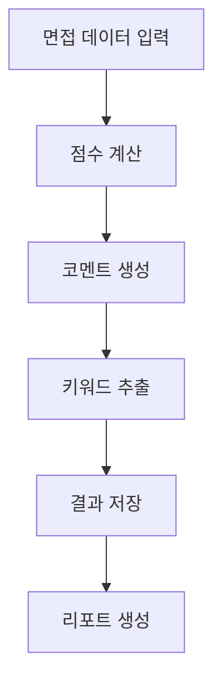
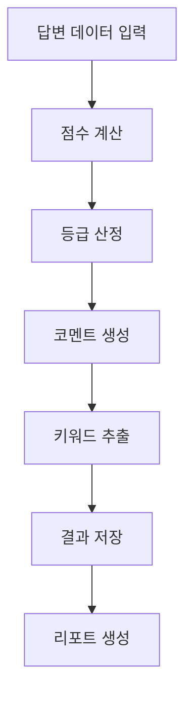

# 🎯 AI 면접 분석 서버

FastAPI 백엔드에서 수집된 면접 데이터를 분석하여 다음 항목들을 자동으로 계산 및 저장합니다:

- 면접자별 평가 항목 점수 평균
- 가중치 기반 최종 점수 및 등급 산정
- 항목별 평가 코멘트 요약 (LLM)
- 면접자별 강점/약점 키워드 추출 (LLM)



## 📁 폴더 구조 및 기능 설명

```
final_report/
├── backend/              # FastAPI 백엔드 서버 (별도 관리)
├── data/                # 데이터 파일 저장
│   ├── answer_category_result_*.csv
│   └── answer_score_*.csv
├── scoring/             # 핵심 분석 모듈
│   ├── core/           # 핵심 유틸리티
│   │   ├── db_connector.py    # DB 연결 관리
│   │   └── db_session.py      # DB 세션 설정
│   ├── score/          # 점수 계산
│   │   ├── score_calculator.py # 점수/등급 계산
│   │   └── run_scoring.py     # 점수 계산 실행
│   ├── comment/        # 코멘트 생성
│   │   ├── comment_generator.py # 평가 코멘트 생성
│   │   └── llm.py             # LLM 유틸리티
│   ├── keyword/        # 키워드 추출
│   │   ├── keyword_extractor.py # 키워드 추출 로직
│   │   └── run_keyword_extractor.py # 키워드 추출 실행
│   └── utils/          # 유틸리티 도구
│       ├── check_tables.py    # DB 구조 검증
│       ├── backup_and_migrate.py # DB 백업/마이그레이션
│       └── update_table_structure.py # 테이블 구조 업데이트
├── run_all.py          # 전체 프로세스 실행
├── show_results.py     # 분석 결과 조회
├── test_data.py        # 테스트 데이터 생성
└── requirements.txt    # 패키지 의존성
```

### 📊 주요 모듈 설명

#### 1. 점수 계산 (`score/score_calculator.py`)
- 평가 항목별 평균 점수 계산
- 가중치 적용하여 최종 점수 계산
- 상대 등급 산정 (A+, A, B+, B, C+, C)
- 순위 계산 및 DB 저장

#### 2. 코멘트 생성 (`comment/comment_generator.py`)
- 평가 항목별 피드백 수집
- GPT-4를 사용한 코멘트 자동 생성
- 평가 항목의 특성을 반영한 맞춤형 코멘트
- 생성된 코멘트 DB 저장

#### 3. 키워드 추출 (`keyword/keyword_extractor.py`)
- 면접자별 피드백 수집
- GPT-4를 사용한 강점/약점 키워드 추출
- 추출된 키워드 DB 저장

### 🔄 실행 방법

1. 가상환경 설정
```bash
python -m venv venv
source venv/bin/activate   # Windows: venv\Scripts\activate
pip install -r requirements.txt
```

2. .env 설정
```bash
cp .env.example .env
# 에디터로 아래 값들을 설정:
# - DATABASE_URL: MySQL 연결 정보
# - OPENAI_API_KEY: GPT-4 API 키
```

3. DB 스키마 생성 (두 가지 방법 중 선택)

a. SQL 파일 사용:
```bash
# MySQL에서 스키마 생성
mysql -u root -p < table_schema_dump.sql
```

b. Python 스크립트 사용:
```bash
# SQLAlchemy를 사용한 테이블 생성
python scoring/utils/create_tables.py
```

4. 초기 데이터 설정
```bash
# 평가 카테고리 초기화
python update_categories.py

# 테스트 데이터 생성 (선택사항)
python test_data.py
```

5. 실행 순서
a. 전체 프로세스 실행:
```bash
python run_all.py  # 점수 계산 → 코멘트 생성 → 키워드 추출 순으로 실행
```

b. 개별 기능 실행:
```bash
# 점수 계산만 실행
python -m scoring.score.run_scoring

# 결과 조회
python show_results.py
```

### 📋 실행 프로세스 상세

1. `table_schema_dump.sql`: DB 테이블 구조 생성
   - 평가 카테고리 (evaluation_category)
   - 답변 점수 (answer_score)
   - 답변 카테고리 결과 (answer_category_result)
   - 면접 결과 (interview_result)
   - 면접 카테고리 결과 (interview_category_result)

2. `update_categories.py`: 평가 카테고리 초기화
   - ENGLISH_ABILITY (가중치: 0.2)
   - COMM_SKILL (가중치: 0.1)
   - PROB_SOLVE (가중치: 0.2)
   - TECH_SKILL (가중치: 0.2)
   - JOB_COMPATIBILITY (가중치: 0.15)
   - ORG_FIT (가중치: 0.15)

3. `test_data.py`: 테스트 데이터 생성
   - 3명의 지원자 데이터 생성
   - 각 평가 항목별 점수 및 키워드 생성
   - answer_score, answer_category_result 테이블 데이터 생성

4. `run_all.py`: 전체 분석 프로세스
   - 점수 계산: answer_category_result → interview_result
   - 코멘트 생성: answer_category_result → interview_category_result
   - 키워드 추출: interview_category_result → interview_result

5. `show_results.py`: 분석 결과 조회
   - 전체 면접 결과 요약
   - 평가 항목별 점수
   - 통계 정보 (등급 분포, 평균/최저/최고)

### 📚 데이터베이스 구조

1. `interview_result`: 면접 결과 정보
   - INTV_RESULT_ID: 면접 결과 ID (PK)
   - APL_ID: 지원자 ID
   - INTV_PROC_ID: 면접 프로세스 ID
   - OVERALL_SCORE: 종합 점수
   - OVERALL_GRADE: 등급
   - OVERALL_RANK: 순위
   - STRENGTH_KEYWORD: 강점 키워드
   - WEAKNESS_KEYWORD: 약점 키워드

2. `answer_category_result`: 평가 항목별 점수
   - ANS_CAT_RESULT_ID: 결과 ID (PK)
   - EVAL_CAT_CD: 평가 항목 코드
   - ANS_SCORE_ID: 답변 점수 ID
   - ANS_CAT_SCORE: 항목 점수

3. `evaluation_category`: 평가 항목 정보
   - EVAL_CAT_CD: 평가 항목 코드 (PK)
   - WEIGHT: 가중치

### 🔍 주요 평가 항목
- ENGLISH_ABILITY: 영어 능력 (통합)
- COMM_SKILL: 의사소통력
- PROB_SOLVE: 문제해결력
- TECH_SKILL: 기술역량
- JOB_COMPATIBILITY: 직무적합도
- ORG_FIT: 조직적합도

### 💡 주요 로직 및 주의사항

#### 1. 데이터 처리 방식
- 각 함수는 DB 세션을 통해 데이터 처리
- 면접자 ID를 따로 전달할 필요 없음 (전체 데이터 자동 처리)
- 각 함수는 독립적으로 실행 가능

#### 2. 데이터 흐름


### 📝 변경 내역

#### 2025-06-24
1. 영어 평가 항목 통합
   - ENGLISH_FLUENCY와 ENGLISH_GRAMMAR를 ENGLISH_ABILITY로 통합
   - 관련 DB 스키마 및 코드 수정

2. 면접 결과 ID 부여 방식 개선
   - INTV_RESULT_ID가 APL_ID를 따라가지 않고 순차적으로 부여 (1,2,3...)
   - 점수 순으로 정렬되어 ID 부여

3. 평가 등급 체계 단순화
   - interview_category_result 테이블에서 CAT_GRADE 컬럼 제거
   - 가중치를 반영한 전체 등급만 표시하도록 변경

### 🔒 제외 대상 (.gitignore)
- Python 관련: `__pycache__/`, `*.pyc`, `*.pyo`, `*.pyd`, `build/`, `dist/`, `*.egg-info/`
- 환경 설정: `.env` (`.env.example` 제외)
- IDE 설정: `.idea/`, `.vscode/`
- 로그 파일: `*.log`
- 가상환경: `venv/`, `ENV/`
- 데이터 파일: `*.csv`
- 백엔드 폴더: `backend/`

### 📋 코드 작성 규칙
1. 모든 파일 최상단에 작성 목적과 변경 이력을 주석으로 기록
```python
# ----------------------------------------------------------------------------------------------------
# 작성목적 : [파일의 주요 기능 설명]
# 작성일 : YYYY-MM-DD
# 
# 변경사항 내역 (날짜 | 변경목적 | 변경내용 | 작성자 순으로 기입)
# YYYY-MM-DD | 최초 구현 | 상세 구현 내용 | 작성자
# ----------------------------------------------------------------------------------------------------
```

2. 주요 함수와 클래스에 상세한 docstring 작성
3. 변수명과 함수명은 명확하고 이해하기 쉽게 작성
4. 에러 처리는 try-except 구문으로 명확하게 처리
5. DB 연결은 `DBConnector` 클래스를 통해 일관되게 관리

### 🔄 데이터베이스 작업 시 주의사항
1. 모든 테이블에 `RGS_DTM`(등록일시)와 `UPD_DTM`(수정일시) 필수
2. FK 관계가 있는 테이블 삭제 시 자식 테이블부터 삭제
3. 데이터 변경 전 반드시 백업
4. 트랜잭션 처리 필수 (commit/rollback)
5. 대용량 데이터 처리 시 배치 처리 권장
